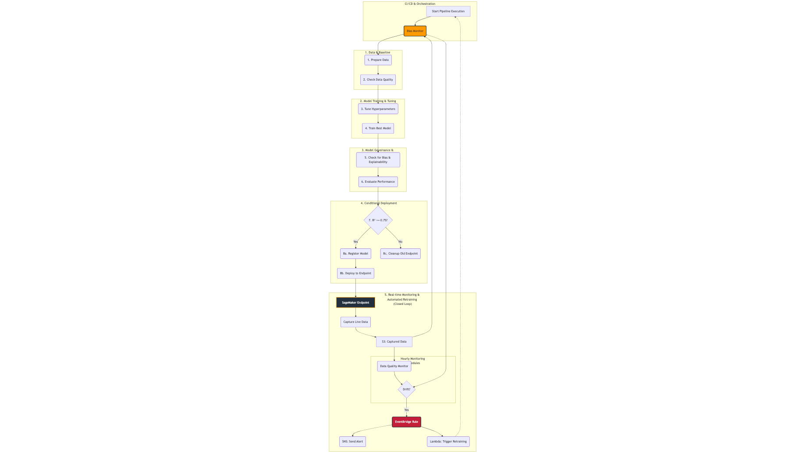
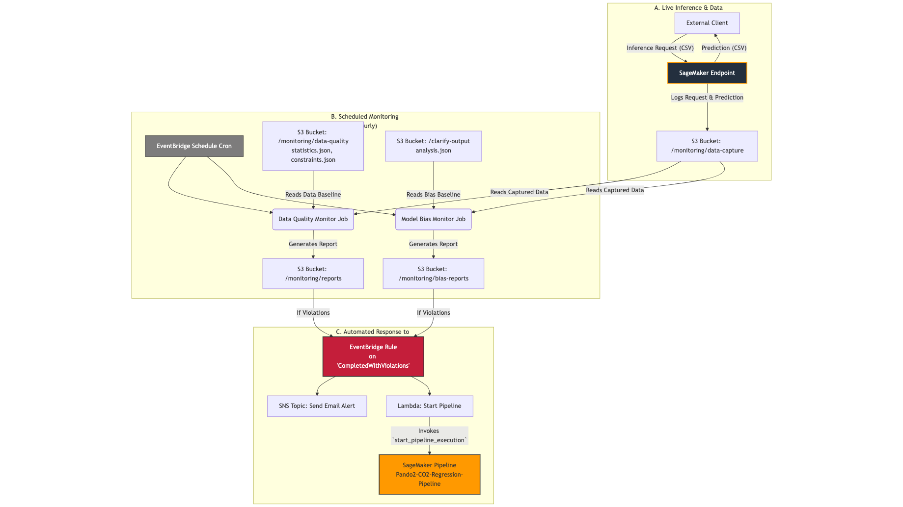

# Modeling Guide: Statistics and XGBoost for CO2 Prediction

This guide explains the core statistical concepts and key XGBoost functions used in this project.

---

## The Core Approach: Supervised Learning for Time-Series

At its core, this project treats a time-series forecasting problem as a **supervised regression problem**.

Instead of using traditional time-series models like ARIMA, we engineer features from the time-stamped data to train a gradient boosting model (XGBoost). This approach is powerful because it allows the model to learn complex, non-linear relationships between the features and the target variable (CO2 level).

---

## Why XGBoost is a Good Choice

*   **Performance**: It is consistently a top performer in machine learning competitions, especially with structured/tabular data.
*   **Flexibility**: It can capture complex, non-linear relationships and interactions between features (e.g., the effect of temperature on CO2 might be different at high vs. low occupancy).
*   **Robustness**: It has built-in regularization techniques (`learning_rate`, `subsample`, etc.) that help prevent overfitting.

---

## End-to-End Pipeline Architecture

This diagram provides a high-level overview of the entire MLOps workflow.



---

## Pipeline Stages 1 & 2: Data and Training

*   **1. Data & Baseline Generation**: The pipeline starts by preparing the data using `preprocess.py` and creating statistical baselines for data quality.

*   **2. Model Training & Tuning**: It uses Hyperparameter Optimization (HPO) to find the best model configuration, then retrains that model on the full dataset to create the final artifact.

---

## Pipeline Stages 3 & 4: Governance and Deployment

*   **3. Model Governance**: The model is checked for bias (using SageMaker Clarify) and evaluated for performance against the test set. These steps act as automated quality gates.

*   **4. Conditional Deployment**: If the model passes the quality gates (e.g., R² > 0.75 and low bias), it is registered in the Model Registry and deployed to a live endpoint. Otherwise, the pipeline can trigger a cleanup process.

---

## Pipeline Stage 5: The Closed Loop

*   **5. Monitoring & Retraining**: The live endpoint's traffic is monitored for data and bias drift. A drift detection event automatically triggers a new pipeline run, creating a self-healing system.

---

## Detailed View: Monitoring & Retraining Loop

This diagram focuses on the autonomous, closed-loop system that runs after the model is deployed. We'll break it down into two parts.




---

## Monitoring Loop Part 1: Data Capture & Analysis

1.  **Live Inference & Data Capture**: The live SageMaker endpoint serves predictions and automatically logs all incoming requests and outgoing predictions to an S3 bucket.
2.  **Scheduled Monitoring**: Hourly jobs are triggered to analyze the captured data.
    *   **Data Quality Monitor**: Checks for drift in the feature distributions compared to the training data baseline.
    *   **Model Bias Monitor**: Checks for drift in bias metrics compared to the baseline established during training.

---

## Monitoring Loop Part 2: Automated Response

3.  **Automated Response**: If any monitor detects a violation (drift), it emits an event to Amazon EventBridge.
4.  **Trigger Actions**: The EventBridge rule triggers two actions in parallel:
    *   Sends an email alert via SNS.
    *   Invokes a Lambda function that starts a new execution of the entire training pipeline, thus "closing the loop."

---

## Feature Engineering Part 1: Lag Features

*   **What they are**: A lag feature is a value from a previous time step. For example, `co2_lag_1` is the CO2 value from the previous measurement, and `co2_lag_3` is from three measurements ago.

*   **Why they are important**: Time-series data often exhibits **autocorrelation**, meaning the value at the present time is highly correlated with its recent past values. The CO2 level right now is a strong indicator of what the CO2 level will be in the next few minutes.

*   **In the Model**: XGBoost can learn rules like: "If `co2_lag_1` was high and `occupancy` just increased, then the current CO2 level is likely to be even higher."

---

## Feature Engineering Part 2: Rolling Window Features

*   **What they are**: These are statistics (like mean, standard deviation) calculated over a moving "window" of time. For example, `temperature_rolling_mean_3` is the average temperature over the last 3 time steps.

*   **Why they are important**:
    *   **Smoothing**: Rolling averages smooth out short-term noise and random fluctuations, giving the model a more stable signal of the recent trend.
    *   **Momentum**: A rolling standard deviation can indicate recent volatility. If the standard deviation of CO2 is high, it might mean the environment is unstable (e.g., doors opening and closing frequently).

*   **In the Model**: These features help the model understand the recent context beyond a single point. It can learn rules like: "If the `co2_rolling_mean` is trending upwards, the current prediction should be higher than what the lag features alone suggest."

---

## Feature Engineering Part 3: Cyclical Features

*   **What they are**: Time-based features like `hour_of_day` or `day_of_week` are cyclical. For example, hour 23 is as close to hour 0 as hour 1 is. Simply using the numbers 0-23 doesn't capture this. We transform them using sine and cosine functions.

    ```python
    df['hour_sin'] = np.sin(2 * np.pi * df['hour']/24.0)
    df['hour_cos'] = np.cos(2 * np.pi * df['hour']/24.0)
    ```

*   **Why they are important**: This transformation places the cyclical data on a 2D circle, allowing the model to understand that morning and evening patterns repeat daily. It helps the model learn daily occupancy schedules or HVAC system behaviors.

---

## XGBoost: The Core Class

This project uses the `xgboost` Python library, specifically its scikit-learn compatible API, which makes it easy to integrate into ML workflows.

### Core Class: `xgboost.XGBRegressor`

This is the main object used in `train.py`. It's a wrapper that makes the powerful XGBoost library behave like a standard scikit-learn model, allowing us to use familiar methods like `.fit()` and `.predict()`.

---

## XGBoost: The Training Method

### Core Method: `model.fit()`

This is the function that initiates the model training process. The key arguments used in this project are:

*   **`eval_set=[(X_val, y_val)]`**: Used during hyperparameter tuning. The model evaluates its performance on this separate validation set after each boosting round, which allows us to monitor for overfitting.

*   **`early_stopping_rounds=10`**: A crucial parameter for performance and cost-saving. If the model's performance on the validation set does not improve for 10 consecutive rounds, training is automatically stopped.

*   **`sample_weight=weights`**: Essential for bias mitigation. This tells XGBoost to pay more attention to certain data points during training by assigning them higher weights.

---

## XGBoost: Key Hyperparameters

These are the "control knobs" for the XGBoost algorithm, defined in `launch_pipeline.py` and passed to the `XGBRegressor`.

| Hyperparameter | What It Is | Impact on Model |
| :--- | :--- | :--- |
| **`objective`** | The loss function the model tries to minimize. Set to `'reg:squarederror'`. | Tells the model its goal is to minimize the mean squared error between its predictions and the true values. This is standard for regression. |
| **`eval_metric`** | The metric used to evaluate performance on the `eval_set`. Set to `'rmse'`. | RMSE (Root Mean Squared Error) is in the same units as the target (CO2 PPM), making it more interpretable than MSE. |
| **`n_estimators`** | The total number of decision trees to build sequentially. | Too few trees will underfit; too many can overfit. This is balanced by `learning_rate` and `early_stopping_rounds`. |
| **`learning_rate`** | A value (0-1) that scales the contribution of each new tree. | **Crucial for anti-overfitting.** A low value (e.g., 0.05) requires more trees but makes the model more robust. A high value learns faster but can overfit. |
| **`max_depth`** | The maximum depth of any individual tree. | Controls the complexity of each tree. Deeper trees (e.g., 8+) can capture complex interactions but are prone to overfitting. Shallower trees (3-6) are more generalized. |
| **`subsample`** | The fraction of training data rows to be randomly sampled for each tree. | Setting this to `0.8` means each tree is built on a different 80% of the data. This randomness helps prevent overfitting. |
| **`colsample_bytree`** | The fraction of columns (features) to be randomly sampled for each tree. | Similar to `subsample`, this adds randomness. If you have many features, it prevents the model from relying too heavily on a few dominant ones. |

---

## The Importance of Hyperparameter Optimization (HPO)

Finding the right combination of hyperparameters manually is slow and often ineffective. HPO automates this search.

*   **What it is**: The process of automatically running many training jobs with different hyperparameter values to find the combination that results in the best model.

*   **Why it's important**:
    *   **Improves Performance**: Directly leads to more accurate models with lower prediction errors.
    *   **Saves Time**: Frees up data scientists from the tedious, manual task of trial-and-error tuning.
    *   **Provides Deeper Insights**: Shows which parameters have the biggest impact on model performance.

*   **In this Project**: The `TuningStep` in `launch_pipeline.py` uses **Bayesian Optimization**, an intelligent search strategy that finds the best model faster than random guessing.

---

## Reporting During Training: Monitoring for Overfitting

During the HPO process, it's crucial to monitor how each model variation is learning.

*   **SageMaker Experiments / MLflow**: Each training job within the HPO step is logged as an "experiment". This creates a leaderboard where you can compare the performance (e.g., RMSE) of all model variations.

*   **Learning Curves**: By tracking the `eval_metric` (`rmse`) on both the training and validation sets at each step, we can plot learning curves.
    *   **Good Fit**: Both training and validation error decrease and converge.
    *   **Overfitting**: The training error continues to decrease, but the validation error starts to increase. This is the exact signal that `early_stopping_rounds` uses to halt training, saving time and preventing a bad model.

---

## Reporting After Training: Evaluating the Final Model

Once the best model is trained, the pipeline generates several critical reports to ensure its quality before deployment.

*   **Evaluation Report (`evaluation.json`)**:
    *   **Purpose**: To score the final model on the unseen test set.
    *   **Key Metrics**: Contains `r2_score` and `mse`. The R² score is used by the `ConditionStep` in the pipeline as a quality gate to decide if the model is good enough to be registered.

*   **Bias and Explainability Report (SageMaker Clarify)**:
    *   **Bias Report**: Checks if the model makes systematically different predictions for different groups (e.g., based on `occupancy`). This is crucial for responsible AI.
    *   **Explainability (SHAP) Report**: Explains *why* the model makes its predictions by showing which features (e.g., `temperature`, `co2_lag_1`) have the most influence.

*   **Data Quality Baseline Report**:
    *   **Purpose**: To create a statistical "fingerprint" (`statistics.json` and `constraints.json`) of the training data.
    *   **Use**: This report isn't for evaluating the model itself, but it's essential for post-deployment monitoring. It serves as the "ground truth" to detect data drift in live traffic.

---

## Summary

By transforming the time-series data into a rich set of features, you enable a powerful regression algorithm like XGBoost to learn complex temporal patterns. The hyperparameters you've configured in your pipeline provide a robust framework for finding an accurate and well-generalized model, while the `fit` method's parameters ensure that training is efficient and can be adapted for advanced techniques like bias mitigation.