# Architecture Diagram: Decoupled RAG Application

This diagram illustrates the refactored client-server architecture of the RAG application. It separates the one-time indexing process from the live query-and-answer workflow.

```mermaid
graph LR
    subgraph "One-Time Setup (Indexing)"
        direction TB
        Admin([👤 Admin/Developer]) -- "1. Runs script" --> BuildIndex["<b>build_index.py</b>"]
        BuildIndex -- "Reads files from" --> LocalFS["Local File System"]
        BuildIndex -- "Creates/Updates" --> PersistentDB[(<br><b>Persistent ChromaDB</b><br>on disk)]
    end

    subgraph "Live System (Querying)"
        direction TB
        
        subgraph "Backend: Retrieval Service"
            MCPServer["<b>MCP Server</b><br>(local_mcp_server.py)"]
            MCPServer -- "Loads index from" --> PersistentDB
        end

        subgraph "Client Application"
            direction LR
            ClientApp["<b>Streamlit App / Console App</b><br>(log_analyzer_app.py)"]
            LocalLLM(Ollama LLM<br>'tinyllama')
        end

        User([👤 User]) -- "2. Asks question in UI" --> ClientApp
        ClientApp -- "3. Sends query via HTTP" --> MCPServer
        MCPServer -- "4. Returns context" --> ClientApp
        ClientApp -- "5. Augments prompt and sends to" --> LocalLLM
        LocalLLM -- "6. Streams response back to" --> ClientApp
        ClientApp -- "7. Displays response to" --> User
    end
```

---

### Diagram Explanation

1.  **User Interface (Streamlit)**: This is the web front-end. The user interacts with the **Sidebar Controls** to load data and the **Chat Interface** to ask questions.

2.  **Local File System**: Represents the files on the machine where the app is running. The `setup_rag_engine()` function reads from the `Project Directory`, while `update_index_with_uploads()` reads from temporary `Uploaded Files`.

3.  **RAG Engine**: This is the core logic of the application, cached in memory by Streamlit to avoid re-initialization on every interaction.
    *   **Core Components**:
        *   `SimpleDirectoryReader`: Loads and parses text from files.
        *   `HuggingFace Embedding Model`: Converts text chunks into vector embeddings.
        *   `Ollama 'tinyllama'`: The local Large Language Model that generates answers.
        *   `ChromaVectorStore`: The in-memory vector database that stores and searches for embeddings.
        *   `Query Engine`: Orchestrates the query process (embedding the query, retrieving context, and calling the LLM).

4.  **Flows**:
    *   **Indexing (1a & 1b)**: The user initiates indexing via the sidebar. The RAG engine reads files, creates embeddings, and stores them in the Chroma vector store.
    *   **Querying (2-6)**: The user asks a question in the chat. The Query Engine retrieves relevant context from the vector store, combines it with the user's question, and sends it to the Ollama LLM to generate a final, streamed answer.